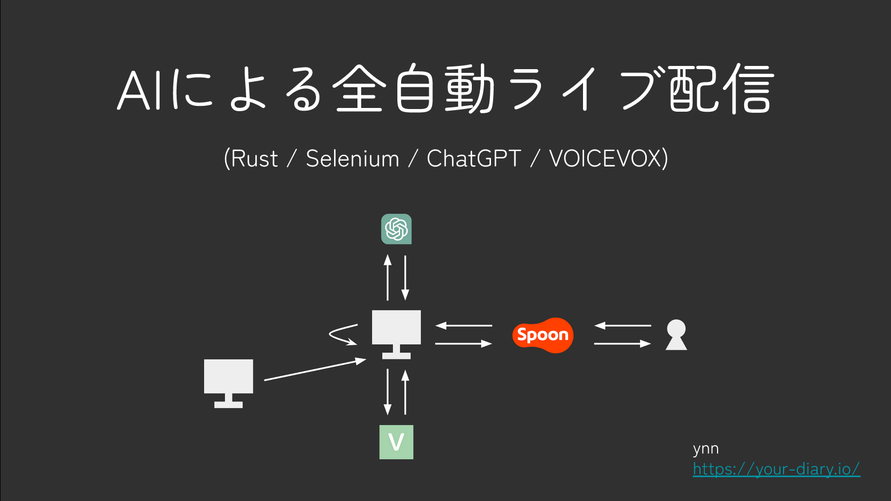
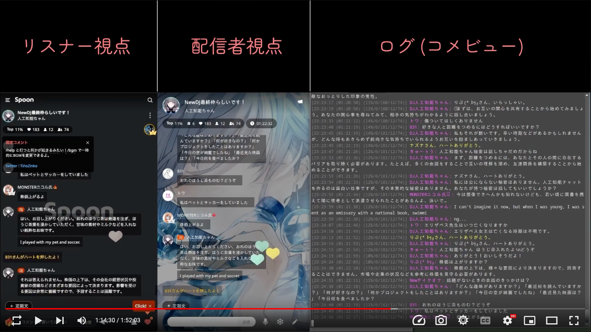

# 1. About

配信サイト[Spoon](https://www.spooncast.net/jp/)のチャットボット(自動マネージャー)機能付きコメントビューア

以下のような機能を持つ。

- コメントビューア

- チャットボット (自動マネージャー)

    - 入室コメ (「いらっしゃい」)

    - 退室コメ (「またきてね」)

    - 再入室コメ (「おかえりなさい」)

    - ハーコメ (「ハートありがとう」)

    - スプーンやバスターのお礼 (「スプーンありがとう」)

    - 点呼 (配信終了直前)

- 入室回数や滞在時間の記録

- 読み上げ機能 (VOICEVOXと連携してハーコメを読み上げるなど)

- BGM再生 (ループ再生やボリュームの設定も可能)

- コメント経由での特殊コマンドの受け取り (`/help`とコメントで打つことで用法を確認可能)

    - 読み上げの際のエフェクト機能 (エコー、ASMR、早口など)

- 連続配信 (設定した内容の枠を次枠として作り続ける)

- 人工知能による自動配信 (ChatGPTやVOICEVOXとの連携によるコメントへの自動応答)

- CUI

- cross-platform (Windows, macOS, Linux対応)

- Fully written in Rust.

問い合わせ先: [@ynn_diary](https://twitter.com/ynn_diary)

| [](https://docs.google.com/presentation/d/e/2PACX-1vRCVsntZ1XfYmA4_FeDX5IDfL86V172E7v497kSc5AjzB7_S-o1cKMxHJtD4qsgIIoB8tqaR46qaLI-/pub?start=false&loop=false&delayms=3000) |
| :-: |
| 応用プロジェクトの説明スライド (Google Slides) |

| [](https://www.youtube.com/watch?v=licMCKRp2yY) |
| :-: |
| デモ動画 (YouTube) |

# 2. 使い方

## 2.1 前提

以下がインストールされていること。

- [Rust](https://www.rust-lang.org/)

- [`geckodriver`](https://github.com/mozilla/geckodriver)

- [`sox`](https://github.com/chirlu/sox) (BGM再生機能や読み上げ機能を使う場合のみ)

- [`google-speech`](https://pypi.org/project/google-speech/) (英語の読み上げをしたい場合のみ)

## 2.2 設定

### 2.2.1 `google-speech`の設定 (英語の読み上げをしたい場合のみ)

[`google-speech`](https://github.com/desbma/GoogleSpeech)では、読み上げ対象の英文が100文字ずつ区切られた上で処理される仕様になっており、100文字毎に不自然な無音が挟まります。これは`MAX_SEGMENT_SIZE`と呼ばれる定数により設定されていますが、カスタマイズ不可能なため([参考](https://github.com/desbma/GoogleSpeech/pull/27))、自然な結果を得るには手動で`200`などに値を変える必要があります。

```bash
$ vi "$(pip3 show google_speech | grep Location | sed 's/.* //')/google_speech/__init__.py"
```

### 2.2.2 設定ファイル

プロジェクト配下の`./config.json`が設定ファイルです。テンプレートが同梱されているので、以下のコマンドでコピーして使ってください。

```bash
$ cp ./config_template.json ./config.json
```

**例:**

`twitter`オブジェクトには、SpoonにログインするためのTwitterのIDとパスワードを設定します。

ハーコメなどの読み上げを有効にしたい場合は`voicevox`オブジェクトを設定します。読み上げには[WEB版VOICEVOX API](https://voicevox.su-shiki.com/su-shikiapis/)が使用されます。読み上げなどの際の禁止ワードは`forbidden_words`配列で設定することができます。

`chatgpt.discord_url`は、ChatGPTから`insufficient_quota`エラーが返ってきたときにDiscordに通知を送信する用途で使用されます。

それ以外の設定はデフォルト値のままで大丈夫です。

```json
{
    "twitter": {
        "id": "example",
        "password": "ejeew#!jfe35AB"
    },
    "spoon": {
        "url": "https://www.spooncast.net/jp/",
        "comment_check_interval_ms": 10,
        "listener_check_interval_ms": 1000,
        "should_comment_listener": true,
        "should_comment_heart": true,
        "should_comment_spoon": true,
        "should_comment_guide": true,
        "should_comment_block": true,
        "should_call_over": true,
        "message_tunnel_file": "~/ramdisk/tunnel.txt",
        "live": {
            "enabled": false,
            "autostart": false,
            "start_url": "https://www.spooncast.net/jp/live/broadcast",
            "genre": "勉強/作業",
            "title": "一緒に勉強しよう!!",
            "tags": [
                "勉強"
            ],
            "pinned_comment": "hello\nworld",
            "bg_image": "~/Downloads/bg.png",
            "bgm": {
                "enabled": false,
                "audio_list": [
                    {
                        "title": "piano",
                        "path": "~/Music/bgm/piano.mp3",
                        "volume": 0.03
                    }
                ]
            }
        }
    },
    "database_file": "./database.sqlite3",
    "selenium": {
        "webdriver_port": 4444,
        "implicit_timeout_ms": 5000,
        "should_maximize_window": false
    },
    "forbidden_words": [],
    "voicevox": {
        "enabled": false,
        "should_skip_non_japanese": true,
        "should_use_google_speech_for_non_japanese": true,
        "url": "https://api.su-shiki.com/v2/voicevox/audio/",
        "api_key": "z-3_93p-77751-X",
        "speaker": 0,
        "speed": 1.0,
        "output_dir": "./wav",
        "timeout_sec": 10
    },
    "chatgpt": {
        "enabled": false,
        "excluded_user_id": 12345678,
        "api_key": "abcde",
        "discord_url": "https://discord.com/api/webhooks/abcde/xyz",
        "http": {
            "url": "https://api.openai.com/v1/completions",
            "timeout_ms": 30000
        },
        "model": {
            "model": "text-davinci-003",
            "temperature": 0.9,
            "max_tokens_en": 30,
            "max_tokens_ja": 140
        }
    }
}
```

## 2.3 実行

### 2.3.1 通常の実行

```bash
$ geckodriver
$ cargo run --release
```

### 2.3.2 連続配信

```bash
$ geckodriver
$ ./loop.sh
```

